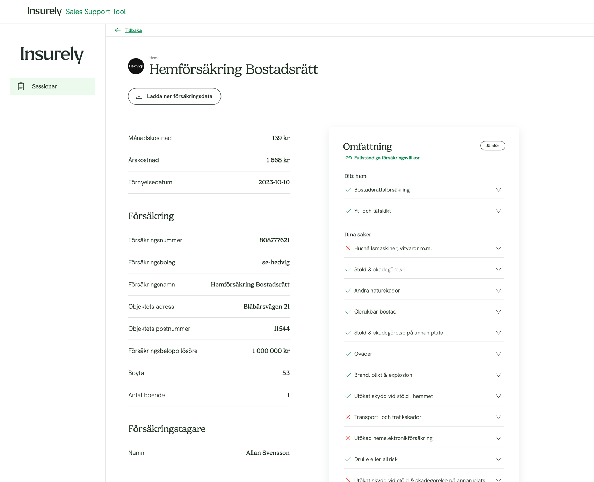
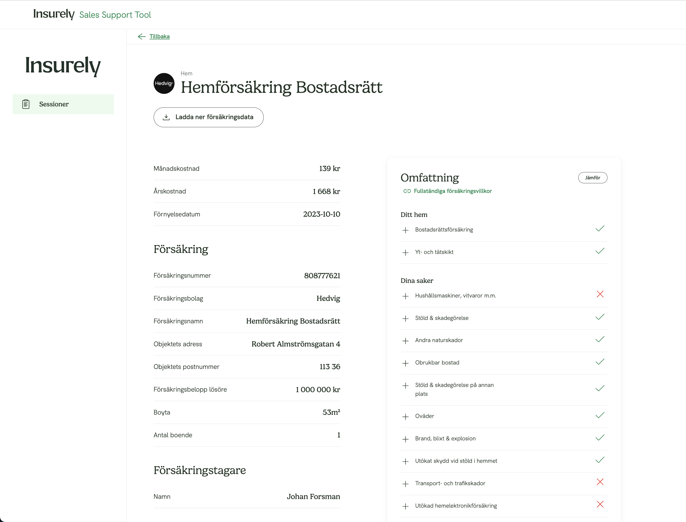

# Insurely frontend code case

## Notes
I worked for around 4 hours on the case, would have needed a bit more time to finish everything up.

### Still TODO:
- Expandable row design is not completed
  - Chevron icon should be a plus/minus and on left side of row content
  - Status icon should be on right side of row content

- Table data formatting
  - Postal code, company name & living area should be formatted
    
- Needs some more work to look good on smaller screens

## The design
### Actual:

### Expected: 

## Building and running

- npm run start

